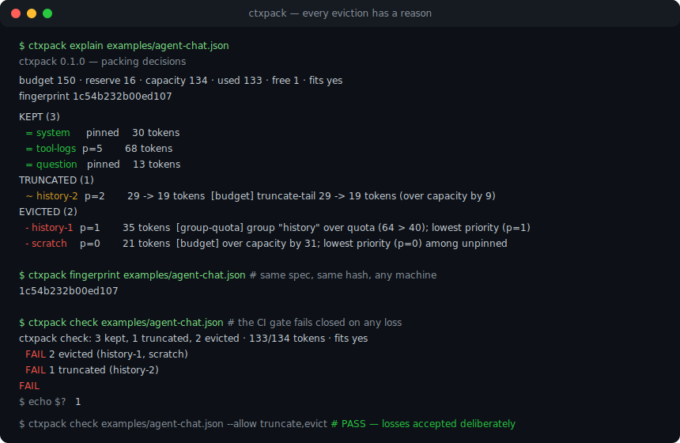
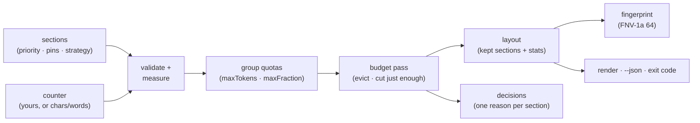

# ctxpack

[English](README.md) | [中文](README.zh.md) | [日本語](README.ja.md)

[](LICENSE)   [](CONTRIBUTING.md)

**決定論的なコンテキストウィンドウ・パッキング：優先度による追い出し、固定セクション、トークン予算、再現可能なレイアウト。**



```bash
# まだ npm 未公開 — このリポジトリの checkout からインストール
git clone https://github.com/JaydenCJ/ctxpack.git && cd ctxpack
npm install && npm run build && npm pack
npm install -g ./ctxpack-0.1.0.tgz
```

## なぜ ctxpack？

どのエージェントのコードベースにも同じ悲しい関数がある。プロンプトが長くなりすぎたときにメッセージ配列を切り詰めるあの関数だ。その場しのぎで書かれ、テストされることはなく、その場しのぎのコードらしい壊れ方をする——追い込まれると system プロンプトを落とし、モデルはトークンで数えるのに文字数で数え、区切り文字にもトークンがかかることを忘れ、本番でプロンプトがおかしくなっても*ウィンドウに実際何が入っていたか*を誰も言えない。フレームワークも実は助けてくれない。LangChain の `trim_messages` はひとつの形（メッセージリスト）とひとつの動き（端から切る）しか知らないし、LLMLingua のようなプロンプト圧縮器は別のモデルでテキストを書き換える——強力だが非決定的で GPU も要る。RAG フレームワークが決めるのは何を*取ってくるか*であり、取ってきた山と履歴とツール出力が予算を超えたとき何を*残すか*ではない。ctxpack はその欠けていたポリシー層だ。各セクションの優先度を宣言し、生き残るべきものを固定し、グループにクォータをかけ、縮め方をセクションごとに選ぶ——返ってくるレイアウトでは、すべての追い出しに機械可読な理由が付き、結果全体にフィンガープリントが付く。同じ spec はあなたのラップトップでも CI でも障害の事後検証でも、バイト単位で同一に詰まる。トークナイザでも RAG フレームワークでもない。モデルのカウンタを持ち込み、検索スタックはそのままでいい。

| | ctxpack | 手書きの切り詰め | LangChain `trim_messages` | LLMLingua 系圧縮器 |
|---|---|---|---|---|
| すべての追い出しに理由を付ける | ✅ コア機能 | ❌ | ❌ | ❌ |
| 決して落とされない固定セクション | ✅ 全パスで強制 | 🟡 覚えていれば | 🟡 keep-system フラグのみ | ❌ |
| 決定論的で再現可能なレイアウト（フィンガープリント） | ✅ | 🟡 たぶん、ただし未検証 | 🟡 | ❌ モデル依存 |
| 優先度 + グループクォータ + セクション別縮小戦略 | ✅ | ❌ ハードコードされた一規則 | ❌ 端から削るだけ | ❌ |
| 区切り文字や省略マーカーも予算に計上 | ✅ 推定でなく実測 | ❌ | ❌ | — |
| 任意のトークナイザに対応（差し替え可能なカウンタ） | ✅ `(text) => number` | 🟡 | ✅ | ❌ 専用モデルが必要 |
| ランタイム依存ゼロ、完全オフライン | ✅ | ✅ | ❌ | ❌ GPU + モデル重み |

<sub>各ツールの公開ドキュメントと挙動に基づく比較、2026-07。ctxpack は圧縮器より意図的に*少ない*ことしかしない：テキストを書き換えず、選んで切るだけ——だからこそ結果が再現可能になる。組み込みカウンタは推定器であり、正直な限界は [docs/pack-spec.md](docs/pack-spec.md) を参照。</sub>

## 特徴

- **説明可能な追い出し** — 入力セクションごとにちょうど 1 件の決定（`keep` / `truncate` / `evict`）が、理由（`pinned`、`fits`、`budget`、`group-quota`、`min-tokens`）と実数値付きで残る。「なぜこれがプロンプトにない？」が調査ではなく参照で済む。
- **固定は不可侵** — pinned セクションはグループクォータを含むすべてのパスを生き延びる。固定分だけで容量を超えるなら `fits: false` と終了コードが返る。system プロンプトが黙って壊れることも、クラッシュすることもない。
- **たったひとつの決定論的な追い出し規則** — 優先度の低い方が先、同点なら入力の早い方が先。履歴を時系列で追加すれば recency 動作が無償で手に入る。
- **必要な分だけ切る切り詰め** — `truncate-tail` / `truncate-head` / `truncate-middle` は超過分だけをカウンタの実測で埋め（推定はしない）、サロゲートペアを壊さず、単語境界にスナップし、`minTokens` を下回るなら無用な切れ端を残さず丸ごと追い出す。
- **現実に合った予算** — 応答用の予約、結合ごとの区切りコスト計上、絶対トークン数または容量比のグループクォータ。すべてモデルと同じカウンタで。
- **再現可能なレイアウト** — モデルが実際に見る内容への FNV-1a 64 ビットフィンガープリント：同じ spec、同じハッシュ、どのマシンでも。ログでのプロンプト diff もキャッシュのキーも文字列ひとつ。
- **ランタイム依存ゼロ、完全オフライン** — 必要なのは Node.js だけ。devDependency は `typescript` のみで、どこにもネットワークアクセスはない。

## クイックスタート

同梱の例を詰めてみる——ウィンドウが全部入るには一段だけ小さいサポートエージェント：

```bash
ctxpack explain examples/agent-chat.json
```

出力（実際にキャプチャした実行結果）：

```text
ctxpack 0.1.0 — packing decisions

budget 150 · reserve 16 · capacity 134 · used 133 · free 1 · fits yes
fingerprint 1c54b232b00ed107

KEPT (3)
  = system     pinned    30 tokens
  = tool-logs  p=5       68 tokens
  = question   pinned    13 tokens
TRUNCATED (1)
  ~ history-2  p=2       29 -> 19 tokens  [budget] truncate-tail 29 -> 19 tokens (over capacity by 9)
EVICTED (2)
  - history-1  p=1       35 tokens  [group-quota] group "history" over quota (64 > 40); lowest priority (p=1)
  - scratch    p=0       21 tokens  [budget] over capacity by 31; lowest priority (p=0) among unpinned
```

`ctxpack pack` は詰めたコンテキストそのものを出力し、`ctxpack check` は同じ実行を CI の終了コードに変える。ライブラリとして、モデルの本物のトークナイザと組み合わせるなら：

```js
import { pack, renderLayout } from "ctxpack";

const layout = pack(
  [
    { id: "system", text: systemPrompt, pinned: true },
    { id: "history", text: transcript, priority: 1, strategy: "truncate-head" },
    { id: "tool", text: toolResult, priority: 5, strategy: "truncate-tail", minTokens: 50 },
    { id: "question", text: userQuestion, pinned: true },
  ],
  { budget: 8000, reserve: 1024, counter: (text) => myTokenizer.count(text) },
);

const prompt = renderLayout(layout); // モデルが見るもの
layout.decisions;                    // 全セクションの「なぜ」
layout.fingerprint;                  // 同じ spec ⇒ 同じハッシュ、どのマシンでも
```

その他のシナリオ——`words` カウンタ、優先度順の並び、`truncate-middle`——は [examples/](examples/README.md) にある。

## コマンド

| コマンド | 動作 | 主なオプション |
|---|---|---|
| `pack <spec>` | 詰めてレンダリング済みコンテキストを出力 | `--json`、`--stats` |
| `explain <spec>` | 決定レポートを出力 | `--json` |
| `check <spec>` | CI ゲート：損失があれば失敗 | `--allow truncate,evict`、`--json` |
| `fingerprint <spec>` | レイアウトのフィンガープリントを出力 | |

spec は JSON ファイルまたは stdin の `-`。`--budget`、`--reserve`、`--counter` で実行ごとに spec を上書きできる。終了コードはスクリプト向き：`0` 正常、`1` 固定オーバーフローまたは check ゲート失敗、`2` 使い方か入力の誤り。

## パッキングポリシー

| つまみ | 既定値 | 効果 |
|---|---|---|
| `priority` | `0` | 高いほど長生き。同点は入力の早い方から追い出す。 |
| `pinned` | `false` | どのパスでも追い出しも切り詰めもされない。 |
| `strategy` | `"drop"` | `drop`、`truncate-tail`、`truncate-head`、`truncate-middle`。 |
| `minTokens` | `0` | この下限を割るなら切り詰めず丸ごと追い出す。 |
| `group` + `groups` | — | `maxTokens` / `maxFraction` でセクション群にクォータ。 |
| `reserve` | `0` | 予算から確保しておく余白（応答用など）。 |

グループクォータはグローバル予算パスの前に走る。両者は同じ犠牲者規則を使い、どちらも固定には触れない。完全な契約——全キー、順序規則、決定論の保証——は [docs/pack-spec.md](docs/pack-spec.md) にある。

## アーキテクチャ



## ロードマップ

- [x] パッキングエンジン（優先度追い出し、固定、グループクォータ、4 つの縮小戦略、reserve + 区切りコスト計上）、差し替え可能カウンタ、レイアウトフィンガープリント、厳格な spec パーサ、`pack`/`explain`/`check`/`fingerprint` CLI、90 テスト + smoke スクリプト（v0.1.0）
- [ ] チャンク化セクション：長い文書を個別に追い出せるチャンクへ分割
- [ ] よくあるチャット形状のメッセージ配列アダプタ（system/user/assistant/tool）
- [ ] モデル別の名前付き予算プロファイル、`--profile` で選択
- [ ] 増分リパック：1 セクションだけ変わったとき決定を再利用
- [ ] パッキング不変条件のプロパティベース・ファジング
- [ ] npm への公開

全リストは [open issues](https://github.com/JaydenCJ/ctxpack/issues) を参照。

## コントリビュート

コントリビュート歓迎。`npm install && npm run build` でビルドし、`npm test` と `bash scripts/smoke.sh`（`SMOKE OK` の出力が必須）を実行する——このリポジトリに CI はなく、上記の主張はすべてローカル実行で検証されている。[CONTRIBUTING.md](CONTRIBUTING.md) を読み、[good first issue](https://github.com/JaydenCJ/ctxpack/issues?q=is%3Aissue+is%3Aopen+label%3A%22good+first+issue%22) を掴むか、[discussion](https://github.com/JaydenCJ/ctxpack/discussions) を始めよう。

## ライセンス

[MIT](LICENSE)
