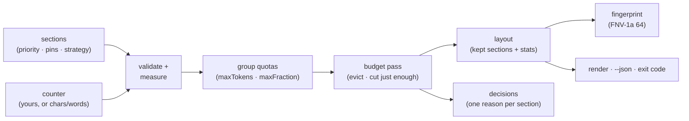

# ctxpack

[English](README.md) | [中文](README.zh.md) | [日本語](README.ja.md)

[](LICENSE)   [](CONTRIBUTING.md)

**Deterministic context-window packing: priority eviction, pinned sections, token budgets, reproducible layouts.**


```bash
# not yet on npm — install from a checkout of this repository
git clone https://github.com/JaydenCJ/ctxpack.git && cd ctxpack
npm install && npm run build && npm pack
npm install -g ./ctxpack-0.1.0.tgz
```

## Why ctxpack?

Every agent codebase contains the same sad function: the one that slices the message array when the prompt gets too long. It is written ad hoc, tested never, and it fails in the ways ad-hoc code fails — it drops the system prompt under pressure, it counts characters when the model counts tokens, it forgets that separators cost tokens too, and when a prompt goes wrong in production nobody can say *what was actually in the window*. The frameworks don't really help: LangChain's `trim_messages` knows one shape (a message list) and one move (cut from an end); prompt compressors like LLMLingua rewrite your text with another model, which is powerful but non-deterministic and needs a GPU; RAG frameworks decide what to *retrieve*, not what to *keep* when the retrieved pile plus history plus tool output exceeds the budget. ctxpack is the missing policy layer: declare each section's priority, pin what must survive, cap groups with quotas, choose how each section shrinks — and get back a layout where every eviction has a machine-readable reason and the whole result has a fingerprint, so the same spec packs byte-identically on your laptop, in CI, and in the incident postmortem. It is not a tokenizer and not a RAG framework; bring your model's counter and keep your retrieval stack.

| | ctxpack | hand-rolled slicing | LangChain `trim_messages` | LLMLingua-style compressors |
|---|---|---|---|---|
| Explains every eviction with a reason | ✅ the core feature | ❌ | ❌ | ❌ |
| Pinned sections that can never be dropped | ✅ enforced by every pass | 🟡 if you remember | 🟡 keep-system flag only | ❌ |
| Deterministic, reproducible layouts (fingerprint) | ✅ | 🟡 usually, unverified | 🟡 | ❌ model-dependent |
| Priority + group quotas + per-section shrink strategy | ✅ | ❌ one hard-coded rule | ❌ end-trimming only | ❌ |
| Charges separators and ellipsis markers to the budget | ✅ measured, not estimated | ❌ | ❌ | — |
| Works with any tokenizer (pluggable counter) | ✅ `(text) => number` | 🟡 | ✅ | ❌ needs its own model |
| Zero runtime dependencies, fully offline | ✅ | ✅ | ❌ | ❌ GPU + model weights |

<sub>Comparison against each tool's public docs and behavior, 2026-07. ctxpack deliberately does *less* than a compressor: it never rewrites your text, it only selects and cuts it — which is exactly why the result is reproducible. Built-in counters are estimators; see [docs/pack-spec.md](docs/pack-spec.md) for honest limits.</sub>

## Features

- **Explainable evictions** — every input section gets exactly one decision (`keep` / `truncate` / `evict`) with a reason (`pinned`, `fits`, `budget`, `group-quota`, `min-tokens`) and the actual numbers, so "why is this not in the prompt?" is a lookup, not an investigation.
- **Pins are sacred** — pinned sections survive every pass, including group quotas; if pins alone exceed capacity you get `fits: false` and an exit code, never a silently mangled system prompt and never a crash.
- **One deterministic eviction rule** — lower priority goes first, ties evict the earlier section first; append history chronologically and recency behavior falls out for free.
- **Truncation that cuts just enough** — `truncate-tail` / `truncate-head` / `truncate-middle` close the exact overflow, re-measured with your counter (never estimated), surrogate-pair safe, snapping to word boundaries, with a `minTokens` floor below which the section is evicted instead of leaving a useless stump.
- **Budgets that match reality** — reserved headroom for the reply, separator costs charged per join, group quotas by absolute tokens or fraction of capacity, all with the same counter your model uses.
- **Reproducible layouts** — FNV-1a 64-bit fingerprints over what the model would actually see: same spec, same fingerprint, any machine; diff prompts in logs and key caches with one string.
- **Zero runtime dependencies, fully offline** — Node.js is the only requirement; `typescript` is the sole devDependency, and nothing ever touches the network.

## Quickstart

Pack the bundled example — a support agent whose window is one notch too small for everything:

```bash
ctxpack explain examples/agent-chat.json
```

Output (real captured run):

```text
ctxpack 0.1.0 — packing decisions

budget 150 · reserve 16 · capacity 134 · used 133 · free 1 · fits yes
fingerprint 1c54b232b00ed107

KEPT (3)
  = system     pinned    30 tokens
  = tool-logs  p=5       68 tokens
  = question   pinned    13 tokens
TRUNCATED (1)
  ~ history-2  p=2       29 -> 19 tokens  [budget] truncate-tail 29 -> 19 tokens (over capacity by 9)
EVICTED (2)
  - history-1  p=1       35 tokens  [group-quota] group "history" over quota (64 > 40); lowest priority (p=1)
  - scratch    p=0       21 tokens  [budget] over capacity by 31; lowest priority (p=0) among unpinned
```

`ctxpack pack` prints the packed context itself; `ctxpack check` turns the same run into a CI exit code. As a library, with your model's real tokenizer:

```js
import { pack, renderLayout } from "ctxpack";

const layout = pack(
  [
    { id: "system", text: systemPrompt, pinned: true },
    { id: "history", text: transcript, priority: 1, strategy: "truncate-head" },
    { id: "tool", text: toolResult, priority: 5, strategy: "truncate-tail", minTokens: 50 },
    { id: "question", text: userQuestion, pinned: true },
  ],
  { budget: 8000, reserve: 1024, counter: (text) => myTokenizer.count(text) },
);

const prompt = renderLayout(layout); // what the model sees
layout.decisions;                    // why, for every section
layout.fingerprint;                  // same spec ⇒ same hash, any machine
```

More scenarios — the `words` counter, priority ordering, `truncate-middle` — live in [examples/](examples/README.md).

## Commands

| Command | Does | Key options |
|---|---|---|
| `pack <spec>` | pack and print the rendered context | `--json`, `--stats` |
| `explain <spec>` | print the decision report | `--json` |
| `check <spec>` | CI gate: fails closed on any loss | `--allow truncate,evict`, `--json` |
| `fingerprint <spec>` | print the layout fingerprint | |

Specs are JSON files or `-` for stdin; `--budget`, `--reserve` and `--counter` override the spec per run. Exit codes are script-friendly: `0` ok, `1` pinned overflow or a failed check gate, `2` usage or input error.

## Packing policy

| Knob | Default | Effect |
|---|---|---|
| `priority` | `0` | Higher survives longer; ties evict the earlier section first. |
| `pinned` | `false` | Never evicted or truncated, by any pass. |
| `strategy` | `"drop"` | `drop`, `truncate-tail`, `truncate-head`, `truncate-middle`. |
| `minTokens` | `0` | Evict rather than truncate below this floor. |
| `group` + `groups` | — | Quota a set of sections by `maxTokens` / `maxFraction`. |
| `reserve` | `0` | Headroom held back from the budget (e.g. for the reply). |

Group quotas run before the global budget pass; both use the same victim rule and both leave pins untouched. The full contract — every key, the ordering rules, the determinism guarantees — is in [docs/pack-spec.md](docs/pack-spec.md).

## Architecture



## Roadmap

- [x] Packing engine (priority eviction, pins, group quotas, four shrink strategies, reserve + separator accounting), pluggable counters, layout fingerprints, strict spec parser, `pack`/`explain`/`check`/`fingerprint` CLI, 90 tests + smoke script (v0.1.0)
- [ ] Chunked sections: split one long document into individually evictable chunks
- [ ] Message-array adapters for common chat shapes (system/user/assistant/tool)
- [ ] Named budget profiles per model, selectable with `--profile`
- [ ] Incremental repack: reuse decisions when only one section changed
- [ ] Property-based fuzzing of the packing invariants
- [ ] Publish to npm

See the [open issues](https://github.com/JaydenCJ/ctxpack/issues) for the full list.

## Contributing

Contributions are welcome. Build with `npm install && npm run build`, then run `npm test` and `bash scripts/smoke.sh` (must print `SMOKE OK`) — this repository ships no CI, every claim above is verified by local runs. See [CONTRIBUTING.md](CONTRIBUTING.md), grab a [good first issue](https://github.com/JaydenCJ/ctxpack/issues?q=is%3Aissue+is%3Aopen+label%3A%22good+first+issue%22), or start a [discussion](https://github.com/JaydenCJ/ctxpack/discussions).

## License

[MIT](LICENSE)
