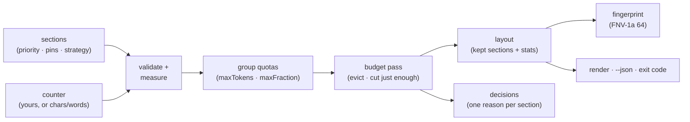

# ctxpack

[English](README.md) | [中文](README.zh.md) | [日本語](README.ja.md)

[](LICENSE)   [](CONTRIBUTING.md)

**确定性的上下文窗口打包引擎：优先级驱逐、固定区块、token 预算、可复现的布局。**


```bash
# 尚未发布到 npm — 从本仓库的 checkout 安装
git clone https://github.com/JaydenCJ/ctxpack.git && cd ctxpack
npm install && npm run build && npm pack
npm install -g ./ctxpack-0.1.0.tgz
```

## 为什么选 ctxpack？

每个 agent 代码库里都有同一个悲伤的函数：prompt 太长时负责裁剪消息数组的那个。它总是临时手写、从不测试，并以临时代码特有的方式出错——压力之下把 system prompt 丢掉、模型按 token 计数它却按字符计数、忘了分隔符也要花 token，而当生产环境里某个 prompt 出了问题，没有人能说清*窗口里当时到底装了什么*。框架也帮不上忙：LangChain 的 `trim_messages` 只认识一种形状（消息列表）和一种动作（从一端切掉）；LLMLingua 之类的 prompt 压缩器用另一个模型重写你的文本，强大但不确定，还需要 GPU；RAG 框架决定*检索什么*，而不是当检索结果加历史加工具输出超出预算时*保留什么*。ctxpack 就是缺失的策略层：为每个区块声明优先级、固定必须存活的内容、用配额限制分组、为每个区块选择收缩方式——得到的布局中每次驱逐都带有机器可读的原因，整个结果带有指纹，同一份 spec 在你的笔记本、CI 和事故复盘里打包出逐字节相同的结果。它不是 tokenizer 也不是 RAG 框架；带上你模型的计数器，保留你的检索栈。

| | ctxpack | 手写裁剪 | LangChain `trim_messages` | LLMLingua 类压缩器 |
|---|---|---|---|---|
| 每次驱逐都给出原因 | ✅ 核心特性 | ❌ | ❌ | ❌ |
| 永远不会被丢弃的固定区块 | ✅ 每个阶段强制执行 | 🟡 全靠你记得 | 🟡 仅有 keep-system 开关 | ❌ |
| 确定性、可复现的布局（指纹） | ✅ | 🟡 通常是，但没验证 | 🟡 | ❌ 依赖模型 |
| 优先级 + 分组配额 + 每区块收缩策略 | ✅ | ❌ 一条硬编码规则 | ❌ 只会从两端裁 | ❌ |
| 分隔符和省略标记都计入预算 | ✅ 实测而非估算 | ❌ | ❌ | — |
| 兼容任意 tokenizer（可插拔计数器） | ✅ `(text) => number` | 🟡 | ✅ | ❌ 需要自己的模型 |
| 零运行时依赖、完全离线 | ✅ | ✅ | ❌ | ❌ GPU + 模型权重 |

<sub>对照各工具公开文档与行为的比较，2026-07。ctxpack 刻意比压缩器做得*更少*：它从不改写你的文本，只做选择和裁切——这正是结果可复现的原因。内置计数器是估算器；诚实的局限见 [docs/pack-spec.md](docs/pack-spec.md)。</sub>

## 特性

- **可解释的驱逐** — 每个输入区块恰好得到一条决策（`keep` / `truncate` / `evict`），带原因（`pinned`、`fits`、`budget`、`group-quota`、`min-tokens`）和真实数字，"为什么它不在 prompt 里？"变成一次查表而不是一场调查。
- **固定区块神圣不可侵犯** — pinned 区块在每个阶段都存活，包括分组配额；若固定区块本身就超出容量，你会得到 `fits: false` 和退出码，绝不会静默弄坏 system prompt，也绝不会崩溃。
- **一条确定性的驱逐规则** — 优先级低者先走，同分时先驱逐输入更早的区块；按时间顺序追加历史，recency 行为免费获得。
- **只切刚好够的截断** — `truncate-tail` / `truncate-head` / `truncate-middle` 只填补确切的超额，用你的计数器实测（从不估算），代理对安全，吸附到词边界，并有 `minTokens` 下限——低于它就整体驱逐，而不是留下无用的残端。
- **符合现实的预算** — 为回复保留余量，每次拼接的分隔符成本照实计费，分组配额按绝对 token 数或容量比例设定，全部使用与你的模型一致的计数器。
- **可复现的布局** — 对模型实际看到的内容做 FNV-1a 64 位指纹：同一 spec、同一指纹、任何机器；用一个字符串就能在日志里 diff prompt、给缓存做键。
- **零运行时依赖、完全离线** — 只需要 Node.js；`typescript` 是唯一的 devDependency，任何环节都不碰网络。

## 快速上手

打包内置示例——一个窗口刚好差一格装不下所有内容的客服 agent：

```bash
ctxpack explain examples/agent-chat.json
```

输出（真实捕获的运行结果）：

```text
ctxpack 0.1.0 — packing decisions

budget 150 · reserve 16 · capacity 134 · used 133 · free 1 · fits yes
fingerprint 1c54b232b00ed107

KEPT (3)
  = system     pinned    30 tokens
  = tool-logs  p=5       68 tokens
  = question   pinned    13 tokens
TRUNCATED (1)
  ~ history-2  p=2       29 -> 19 tokens  [budget] truncate-tail 29 -> 19 tokens (over capacity by 9)
EVICTED (2)
  - history-1  p=1       35 tokens  [group-quota] group "history" over quota (64 > 40); lowest priority (p=1)
  - scratch    p=0       21 tokens  [budget] over capacity by 31; lowest priority (p=0) among unpinned
```

`ctxpack pack` 打印打包后的上下文本身；`ctxpack check` 把同一次运行变成 CI 退出码。作为库使用时，接上你模型的真实 tokenizer：

```js
import { pack, renderLayout } from "ctxpack";

const layout = pack(
  [
    { id: "system", text: systemPrompt, pinned: true },
    { id: "history", text: transcript, priority: 1, strategy: "truncate-head" },
    { id: "tool", text: toolResult, priority: 5, strategy: "truncate-tail", minTokens: 50 },
    { id: "question", text: userQuestion, pinned: true },
  ],
  { budget: 8000, reserve: 1024, counter: (text) => myTokenizer.count(text) },
);

const prompt = renderLayout(layout); // 模型看到的内容
layout.decisions;                    // 每个区块的"为什么"
layout.fingerprint;                  // 同一 spec ⇒ 同一哈希，任何机器
```

更多场景——`words` 计数器、按优先级排序、`truncate-middle`——见 [examples/](examples/README.md)。

## 命令

| 命令 | 作用 | 主要选项 |
|---|---|---|
| `pack <spec>` | 打包并打印渲染后的上下文 | `--json`、`--stats` |
| `explain <spec>` | 打印决策报告 | `--json` |
| `check <spec>` | CI 闸门：有任何损失即失败 | `--allow truncate,evict`、`--json` |
| `fingerprint <spec>` | 打印布局指纹 | |

spec 是 JSON 文件，`-` 表示 stdin；`--budget`、`--reserve` 和 `--counter` 可对单次运行覆盖 spec。退出码对脚本友好：`0` 正常，`1` 固定区块溢出或 check 闸门失败，`2` 用法或输入错误。

## 打包策略

| 旋钮 | 默认值 | 效果 |
|---|---|---|
| `priority` | `0` | 越高活得越久；同分时先驱逐输入更早的区块。 |
| `pinned` | `false` | 任何阶段都不会驱逐或截断。 |
| `strategy` | `"drop"` | `drop`、`truncate-tail`、`truncate-head`、`truncate-middle`。 |
| `minTokens` | `0` | 低于此下限时整体驱逐而非截断。 |
| `group` + `groups` | — | 用 `maxTokens` / `maxFraction` 给一组区块设配额。 |
| `reserve` | `0` | 从预算中扣留的余量（例如留给回复）。 |

分组配额在全局预算阶段之前运行；两者使用同一条受害者规则，都不会碰固定区块。完整契约——每个键、排序规则、确定性保证——在 [docs/pack-spec.md](docs/pack-spec.md)。

## 架构



## 路线图

- [x] 打包引擎（优先级驱逐、固定区块、分组配额、四种收缩策略、reserve + 分隔符计费）、可插拔计数器、布局指纹、严格 spec 解析器、`pack`/`explain`/`check`/`fingerprint` CLI、90 个测试 + smoke 脚本（v0.1.0）
- [ ] 分块区块：把一篇长文档切成可独立驱逐的块
- [ ] 常见对话形状的消息数组适配器（system/user/assistant/tool）
- [ ] 按模型命名的预算档案，用 `--profile` 选择
- [ ] 增量重打包：只有一个区块变化时复用决策
- [ ] 对打包不变量做基于属性的模糊测试
- [ ] 发布到 npm

完整列表见 [open issues](https://github.com/JaydenCJ/ctxpack/issues)。

## 贡献

欢迎贡献。用 `npm install && npm run build` 构建，然后运行 `npm test` 和 `bash scripts/smoke.sh`（必须打印 `SMOKE OK`）——本仓库不带 CI，以上每一条声明都由本地运行验证。参见 [CONTRIBUTING.md](CONTRIBUTING.md)，认领一个 [good first issue](https://github.com/JaydenCJ/ctxpack/issues?q=is%3Aissue+is%3Aopen+label%3A%22good+first+issue%22)，或发起一个 [discussion](https://github.com/JaydenCJ/ctxpack/discussions)。

## 许可证

[MIT](LICENSE)
